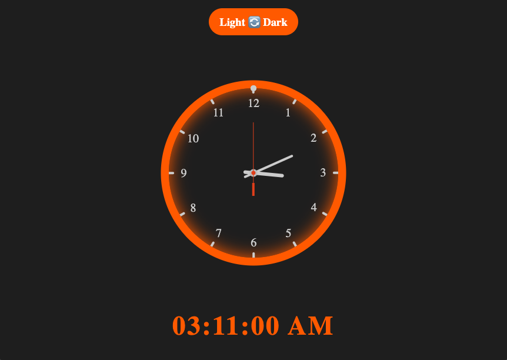
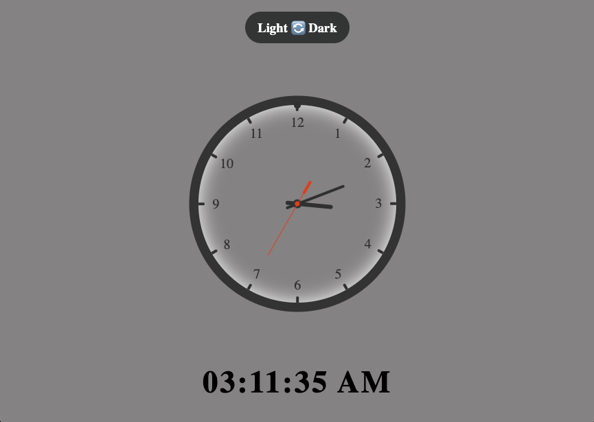

# ⏰ Digital & Analog Clock

A beautiful and responsive clock with **both analog and digital displays**. You can also **toggle between Light & Dark themes**!  
Check out the **live version** 👉 [Click here](https://homa-x.github.io/Digital-Analog-Clock/)

---

## 📸 Screenshots
## 🌚 DarkMode

## 🌞 LightMode



---

## 🧠 Features

- 🕒 Analog Clock with smooth animation  
- 🧮 Digital Clock with AM/PM format  
- 🌗 Toggle button for **Light / Dark** themes  
- 💾 Saves selected theme using `localStorage`  
- 📱 Fully responsive design  
- 🎨 CSS variables for easy customization

---

## 🛠️ Built With

- HTML5  
- CSS3 (with custom properties)  
- JavaScript (Vanilla JS)

---

## 🚀 How to Use

1. Clone the repository:
   ```bash
   git clone https://github.com/Homa-X/Digital-Analog-Clock.git
